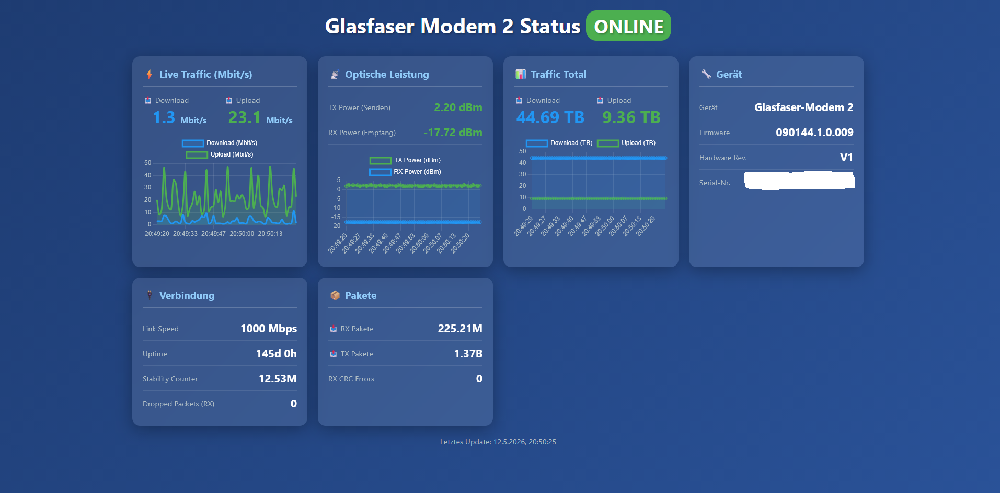

# Glasfaser Modem 2 Status Dashboard



Real-time monitoring dashboard for Telekom Glasfaser-Modem 2.

## Features

- **Real-time power levels**: TX/RX optical power (dBm)
- **Traffic monitoring**: TX/RX bytes with live graphs
- **Device info**: Firmware, hardware revision, serial number
- **Connection status**: Link speed, uptime, packet counts
- **Real-time updates**: Live data every second

## Data Source

Fetches data from: `http://192.168.100.1/ONT/client/data/Status.json`

**Important**: Requires `Accept-Language: de` header for successful requests.

## Quick Start

### Docker (Recommended)

```bash
docker-compose up -d
```

Dashboard will be available at: http://localhost:8080

### Manual Start

```bash
npm install
npm start
```

## Deployment

The dashboard can run on any server with network access to the modem.

```bash
git clone https://github.com/torty851/glasfaser-modem-dashboard.git
cd glasfaser-modem-dashboard
docker-compose up -d
```

Access: http://localhost:8080

## Tech Stack

- **Backend**: Node.js + Express
- **Frontend**: Vanilla JS + Chart.js
- **Container**: Docker
- **Port**: 8080

## API Endpoints

- `GET /api/status` - Current modem status (JSON)
- `GET /api/health` - Server health check

## Metrics Displayed

| Metric | Description |
|--------|-------------|
| TX Power | Optical send power (dBm) |
| RX Power | Optical receive power (dBm) |
| TX Bytes | Total bytes sent |
| RX Bytes | Total bytes received |
| TX Packets | Total packets sent |
| RX Packets | Total packets received |
| Link Speed | Connection speed (Mbps) |
| Uptime | Modem uptime |
| Firmware | Current firmware version |
| Stability | Stability counter |

## License

MIT